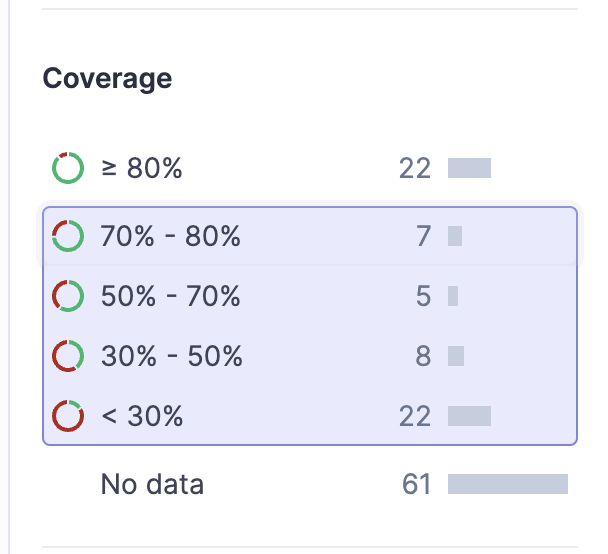

# Sonarqube
Code Quality Assurance is a tool that collects and analyzes source code to provide global metrics and standards for Reliability, Security, and Maintainability.

### Clean As You Code
Clean as You Code™ ensures high code quality and security by helping developers ensure that every code change committed to a project is free of issues and vulnerabilities.

The only expectation of developers is to ensure that the New Code - added or changed - adheres to Clean Code standards and does not introduce new issues.

### Learn As You Code
When writing Clean Code, it's not enough to find and fix issues. Developers should have the opportunity to find, understand, and resolve issues optimally. Sonarqube provides the necessary information to resolve raised issues.

This helps developers learn from their mistakes, address today's issues faster, and internalize best practices to avoid reproducing the same issues in the future.

## Developing With Sonar

### Quality Gate (Conditions on New Code):
* Coverage is more than 80.0% 
* Duplicated Lines (%) is less than 3.0% 
* Maintainability Rating is A (Technical debt ratio is less than 5.0%)
* Reliability Rating is A (No bugs)
* Security Rating is A (No vulnerabilities)
* Security Hotspots Reviewed is 100% 

Note: Custom Quality Gate and Rules can be modified on specific projects upon request on #sonarqube slack channel

## Code Quality Monitoring
Integrating sonarqube into your CICD is just the first step to ensure Code Quality. Sonarqube enables us to easily monitor all your team/domain's projects and see what projects are not abiding the Quality Gate standard.

1. Add tags to your project(s) by going to: Your Project > Project Information > Tags > + 
2. To monitor projects that you've tagged, use Filtering function in Sonarqube sidebar. Here you can filter projects by Tag (see first image above).
3. Further filter your projects by Quality Gate areas: Reliability, Security, Maintainability, Coverage, etc to group projects by their grade/metrics
4. Change Filter `Perspective` to `New Code` to only monitor code quality on new codes (since Sonarqube Integration) or `Overall Status` to monitor overall code quality even before Sonarqube Integration. 
  - `New Code` is recommended when monitoring `Clean As You Code`
  - `Overall Status` is recommended when monitoring overall Code Coverage for your projects

## Contributing
See [CONTRIBUTING](CONTRIBUTING.md).
